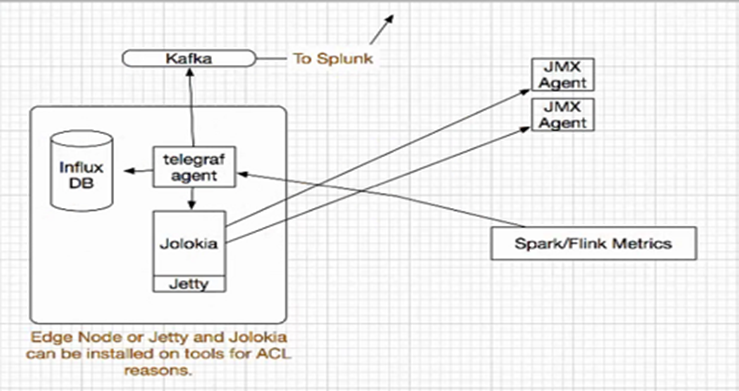

# PNDA-METRICS

* PNDA cluster writes metrics to graphite.  In release 4.0, Spark metrics from all executors will sink to graphite.  
* Influx DB is installed and configured to hold all metrics required by the  back end systems.
* A telegraf agent is used to collect data from JMX sources (Kafka brokers) through Jolokia plugin. 
* Telegraf agent is configured to output the collected data to Influx DB.   
* Influx DB is also configured to source and store metrics from graphite.
* Telegraf agent can also be configured to produce data to Kafka.

# Build Script
* Build server need to have access Internet, to download the packages
* User need to have existing PNDA mirror server
* User need to have access to mirror server , to copy the mirror_metrics  directory created by build script to PNDA_MIRROR/mirror_metrics
* Deployment script going to use existing PNDA_MIRROR/mirror_misc packages [java package for jetty]
* Build script need to run as root
 
# Run Build script

Step1 : clone the PNDA_METRICS 
 
     git clone https://github.com/janselva/PNDA-METRICS.git
 
Step2: Run Build script
 
      sudo su
     
      cd build 
 
      ./build_metrics.sh
 
Step3: copy the mirror_metrics directory to pnda mirror server.
 
 
 
# Deployment script
 
* Deployment server is reachable to Metrics server either directly or through bastion server.
* Metrics username provide in the metrics_env.yaml file must be a sudo user
* Metric server reachable to the mirror server , to download packages
* Metrics packages will be download only from mirror server
* Telegraf input,output and socket listeners detail provide in the metrics_env.yaml file
* Script tested in AWS environment.
* Deployment logs stored in deployment server itself

# Run Deployment script

step1: create  cli/metrics_env.yaml file 

        cp metrics_env_example.yaml cli/metrics_env.yaml
        
        Edit cli/metrics_env.yaml based on your setup 
     
Step2:  run python script

        
        
        cd cli

        python metrics_cli.py

Step3: Logs will be stored in cli/logs folder

# Tested Environments

 * operating system tested : RHEL7.4 <AWS Platform>
 * Deployment server Python version tested : 2.7
  
# software Versions

 * INFLUXDB_VERSION: 1.4.2
 * JETTY_VERSION: 9.4.7
 * JOLOKIA_VERSION: 1.3.7
 * TELEGRAF_VERSION: 1.5.0-1
